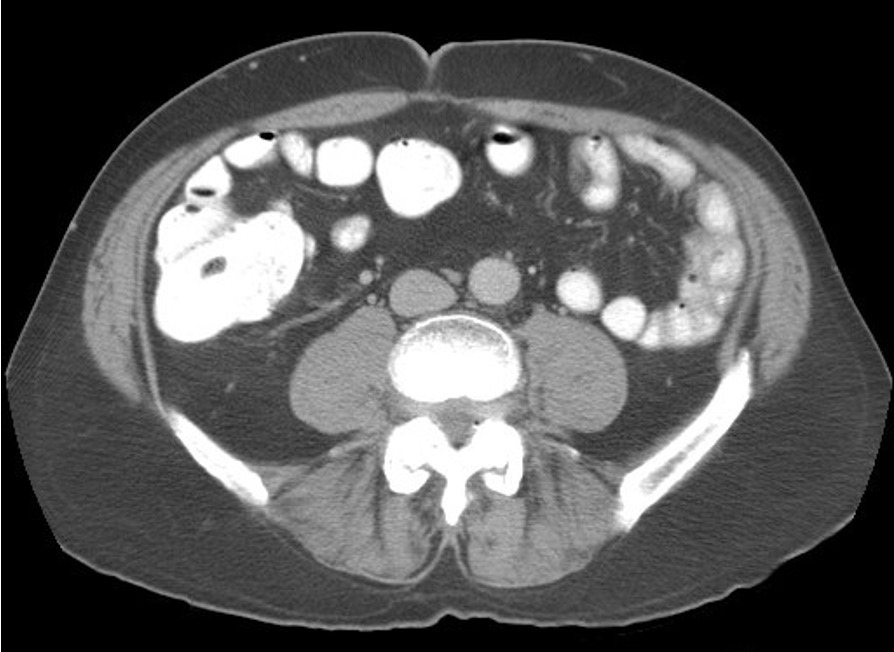
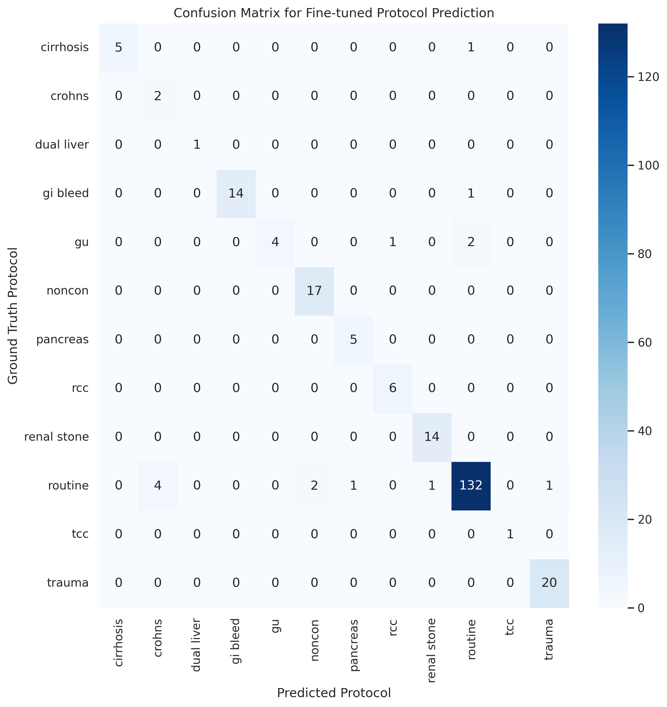

# Automated Abdominal CT Protocoling Using Fine-Tuned LLM
#aipi590 project 1 

This project fine tunes a Mistral 7B Instruct model to protocol CT scans. 



## Background
Performing the appropriate type of abdominal CT scan is important to high quality clinical care. The decisions of whether or not to use enteric contrast or IV contrast and the timing (phases) of imaging relative to IV contrast administration are encapsulated into specific protocols, which serve as recipes for performing the CT scan. Typically, this is performed entirely or in part by an individual, often a physician, and can be a time-intensive process given the large number of CT orders and occasionally vague statements of the indication for the examination necessitating review of the medical record. Automation of this process would allow the radiologist to focus time on other clinical duties such as interpreting scans. Large Language Models, which have shown a large number of promising uses in radiology, and may be well suited to incorporate information from the clinical chart into the protocol decision. While GPT-4 may be able to perform this task, HIPAA and privacy issues make data preclude releasing the sensitive data to the cloud. This project assesses the feasibility of using a fine-tuned open source local model, Mistral 7B Instruct, for this protocoling task.

Prior efforts have looked at other machine learning models in conjunction with NLP for text embeddings, achieving F1 scores for protocol selection to be in the range of 0.8-0.85 for various types of machine learning models including Random Forest, Gradient Boosted Tree, among others [1]. To our knowledge, there are no published reports of using an LLM for this task, although authors have speculated upon the potential for this use case [2]. 

## Methods
I used Mistral 7B Instruct-v0.2 as a base model and then fine-tuned over the training dataset. 
1. Training dataset - comprised of approximately 1200 exsamples of a typical order for an abdominal CT scan and some of the information accessible in the EHR when completing a protocoling task, including the serum creatinine (a marker of renal function- high creatinine above 2.0 mg/dL is a relative contraindication to giving IV contrast due to the risk of Contrast-Induced Nephropathy, unless the patient is on dialysis), the presence and severities of contrast allergy, and a brief clinical summary of 2-3 sentences. The order and prior CT protocol data are real clinical data from the EHR, whereas the other data were synethesized by GPT-4 (the clinical summary) or arbitrarily set. I performed the protocol task based on this set of inforation as the ground truth for comparison.
2. The prompt was comprised of a brief set of instructions followed by the clinical data. A typical prompt is given below:
   ```
   The task is to use the provided information for each patient to return the predicted protocol for the CT study in the form of a json object like this:
   {"predicted_order": "CT abdomen pelvis with contrast", "predicted_protocol": "routine", "predicted_comments": ["oral contrast"]}
   The response should be the json object and nothing else. 

   'Order: CT chest abdomen pelvis with contrast with MIPS
   Prior Order: CT abdomen pelvis without contrast
   Reason for Exam: Metastatic melanoma, of uncertain site
   Contrast Allergy: 0
   Allergy severity:
   Creatinine (mg/dL): 1.1
   On Dialysis: 0 
   Clinical Summary: The patient is a 45-year-old male with newly diagnosed melanoma (Clark level IV) arising from the left great toe. The scan is for initial staging purposes.’
   ```

Of note, another longer instruction prompt was also used, wihch was not technically feasible, causing memory issues on the fine-tuning task. For reference, here is the longer instruction prompt without the clinical data: 
   ```
   Use the inputs to expertly decide on the appropriate protocol for the CT study.  The description of each CT protocol is given in the text below (the name to return for each protocol is in parentheses). For scans in which the order does not match the desired protocol, or if there are other outstanding questions the radiologist needs to resolve (e.g., elevated creatinine above 2.0 mg/dL or history of severe allergic reaction to IV contrast such as trouble breathing, throat swelling, or anaphylaxis, and contrast enhanced scan ordered), then add a comment that will route the case back to the radiologist (comments should be from the list given below.
   
   Also, note it is okay to over-image, but ideally no simpler protocols for studies that require multiphase imaging.
   Any acute hemorrhage is ideally scanned by the GI bleed protocol (CT with and without contrast, with arterial and venous phases). 6. Any study specifically ordered to evaluate the chest only (such as a PE study), or the thoracic-abdominal aorta or leg arteries should be routed to the chest/cardiovascular imaging division.
   If there is an indeterminate renal or adrenal mass on the prior study, it can be evaluated by adding pre contrast images through the abdomen in addition to the regular protocol (comment: 'precontrast through kidneys or adrenals'). That can be added on without communicating with the ordering provider.
   
   Here is a description of the protocols:
   
   Routine (routine):  Protocol for most patients includes portal venous phase imaging.  No oral contrast is administered by default, but can be added through comments.
   
   Noncontrast (noncon): Protocol when no contrast is indicated or there are contraindications such as severe allergy or elevated creatinine. There are reasons why contrast may not be wanted by the ordering provider even if no contraindications, such as a solitary kidney and mild renal failure.
   
   Dual Liver Protocol (dual liver):  Known or suspected hypervascular liver tumor or suspected metastases from a primary tumor outside the liver for which there are suspected hypervascular liver metastases.  It includes both the hepatic arterial and portal venous phases.  Currently the list of malignancies for this protocol includes neuroendocrine, carcinoid, and thyroid carcinoma.
   
   Cirrhosis Protocol (cirrhosis):  Known or suspected cirrhosis and/or have a known or suspected hepatocellular carcinoma.  It also should be performed in all patients with suspected benign primary liver tumors, such as focal nodular hyperplasia or hepatic adenoma.  This protocol includes acquisitions in the hepatic arterial and the portal venous phases, as well as a delayed phase.
   
   Hepatic Resection Protocol (hepatic resection):  Indicated in all patients anticipating hepatic resection.  It includes thin section images of the liver to include celiac axis and proximal SMA during the hepatic arterial phase and thicker sections through the liver during the portal venous phase.  The images obtained during the hepatic arterial phase undergo volume rendering in 3D.
   
   Radioembolization Protocol (radioembo):  Typically ordered by the Interventional Radiologists for evaluation of a patient following (and possibly before) embolization therapy. This includes arterial and venous phases through the abdomen. The post processing is slightly different than the cirrhosis protocol in that thin images are sent in both arterial and portal venous phases for the 3D lab to assess the vasculature and liver volumes. It should be specifically mentioned in the order, otherwise do not use the protocol.
   
   Pancreas Protocol (pancreas):  Known or suspected pancreatic tumor.  It is occasionally requested in patients with either acute or chronic pancreatitis.  It includes thin section images of the pancreas to include the celiac axis and SMA during the pancreatic phase and images of the liver and pancreas during the venous phase.  Arterial phase images are reconstructed in 3D.
   
   Cholangiocarcinoma Protocol (cholangiocarcinoma):  Known or suspected cholangiocarcinoma.  It includes images of the liver in the portal venous phase as well as through the hilum following a 10 minute delay.  Coronal reformats of the venous phase are included.
   
   Trauma Chest/Abdomen/Pelvis (trauma):  Suspected trauma. Arterial phase imaging through the upper and mid chest followed by portal venous phase imaging of the abdomen and pelvis.  No oral contrast.
   
   Crohns Protocol (crohns):  Evaluation to look for suspected Crohns involvement, but not necessarily for complications of Crohn’s.  If a relatively asymptomatic patient, the patient receives VolumenTM (a negative contrast agent). Enteric arterial phase images of the abdomen and pelvis are acquired, and sagittal and coronal reformats are also included. Similar to other Bowel Protocol except that only a single phase is acquired to minimize radiation dose.
   
   CT Colonography (colon):  For colon cancer and polyp screening.  The patient undergoes bowel prep the night before the scan as well as barium tagging.  Insufflation of CO2 via device after placement of tube into rectum.  Supine and prone imaging, as well as decubitus position if nondistended segments on the two standard positions.
   
   Renal Stone Protocol (renal stone):  Acute flank pain and/or a known or suspected renal calculus.  It includes a low dose noncontrast CT of the kidneys, ureters and bladders with the patient in prone position (unless unable).  Coronal reformats are provided.
   
   Genitourinary Protocol (gu):  Hematuria, known or suspected renal mass, or other indications where evaluation of the ureters is necessary.  It includes low dose non-contrast images of the kidneys only followed by nephrographic phase images of the kidneys and 7 min delayed excretory phase images of the kidneys, ureters, and bladder.  Coronal reformats of the excretory phase are included.
   
   Focused Renal Cyst Protocol (focused renal cyst): For followup of a complicated renal cyst. Pre- and Post-contrast (Nephrographic) imaging through the kidneys to assess for enhancement. There is no imaging of the pelvis and no CT urogram. If in doubt, use the more complete GU Protocol.
   
   RCC Protocol (rcc):  Known renal cell carcinoma, typically in patients who have undergone a nephrectomy or nephron sparing treatment, or possibly for preoperative planning.  It includes noncontrast images of the kidneys followed by a dual liver as described above to assess for metastases.  Coronal reformats in the venous phase are included.
   
   TCC Protocol (tcc):  Intended for patients with known transitional cell carcinoma or bladder cancer, typically who have undergone a cystectomy, focal bladder surgery, or nephroureterectomy.  It is a split bolus technique, with the goal of imaging the patient in both the excretory phase and the portal venous phase in a single acquisition following two boluses of IV contrast prior to scanning.
   
   Renal Donor Protocol (renal donor):  To evaluate the renal anatomy of potential renal donors.  This includes thin section images of the kidneys and renal arteries during the arterial phase and venous phase.  A delayed scout is obtained to document the number of ureters.  A separate 3-D interpretation is performed.
   
   Adrenal Protocol (adrenal): For the evaluation of an indeterminate adrenal mass.  Noncontrast images through the adrenal gland.  The scan is then checked by a physician for further imaging.  If the physician deems necessary, portal venous and 15 minute delayed images through the adrenals follow.
   
   CT Cystogram (cystogram):  To evaluate for bladder injury (typically after pelvic trauma) or a fistula.  Contrast (Renografin 60 diluted in saline) is instilled by gravity through an indwelling Foley catheter.
   
   
   
   And for predicted_comments, add comments from the following list if appropriate:
   'oral contrast' if oral (otherwise known as PO) contrast has been requested in the indication.
   'steroid prep' if has a mild allergy to contrast and a contrasted scan has been requested
   'reroute contrast' if the patient has a contraindication to contrast such as elevated creatinine above 2.0 or severe/anaphylaxis contrast allergy
   'reroute coverage' if addition body parts may need to be added to the planned procedure
   'low pelvis' which extends the caudal range of a CT, particularly for malignancies that may not be fully imaged on our routine protocols which includes vulvar cancer, anal cancer, and perhaps rectal cancer if this is the first time evaluation or there is known recurrent disease low in the pelvis.  Things in the inguinal region or upper thigh or perirectal abscess or perianal fistulous disease may be other possible indications. Perineal infection such as Fournier's gangrene would aslo require this.
   'reroute protocol' if there is a complex process such as a fistula that might not be evaluated well on the routine protocols.
   'split' indicates the chest order will be read separately from the abdomen and pelvis, which occurs for lung and esophgeal cancer and for patients with lung transplants
   'valsalva' indicates the imaging is performed while patient does a valsalva maneuver for evaluation of hernias.
   
   The task is to use the provided information for each patient to return the predicted protocol for the CT study in the form of a json object like this:
   {"predicted_order": "CT abdomen pelvis with contrast", "predicted_protocol": "routine", "predicted_comments": ["oral contrast"]}
   The response should be the json object and nothing else.

   ```

3. The output was expected to be JSON format as below:

   ```
   {"accession": "800774", "predicted_order": "CT chest abdomen pelvis with contrast w MIPS", "predicted_protocol": "routine", "predicted_comments": []}
   ```
4.  A custom scoring function was used for the extracted portion of text output corresponding to the JSON object, giving 0.3 points if the output was in JSON format with the expected keys, 0.5 points if the predicted_protocol matched, and 0.1 points each if the predicted_order and predicted_comments matched, for a total of 1.0 points.
5.  Fine-tuning was performed using the QLora ...
   

## Results

Custom scores on Test dataset:
```
Base Model (Mistral 7B Instruct) - 0.72 

Fine-Tuned Model - 0.95
```
For the performance on the protocol class alone, the accuracy for the base model was 73% and that for the fine-tuned model was 94%. The confusion matrix for the fine-tuned model is shown below:




## References
1. [Xavier BA, Chen PH, Natural Language Procesing fo Imaging Protocol Assignment, Journal of Digital Imaging (2022) 35:1120–1130.](https://doi.org/10.1007/s10278-022-00633-8)
2. Bhayana R, Chatbots and Large Language Models in Radiology: A Practical Primer for Clinical and Research Applications, Radiology 2024; 310(1). [Link]https://doi.org/10.1148/radiol.232756)
3. 
